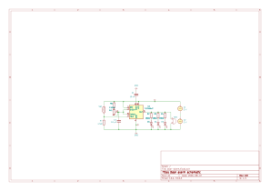

[](/LICENSE)


# Door alarm PCB design
Repository with the PCB design for the door alarm project.


## 📋 Schematic



## 📐 3D view
```stl
solid
 facet normal  0.000000e+00 -1.000000e+00 -0.000000e+00
   outer loop
     vertex  1.338000e+02 -7.863750e+01  2.090000e+00
     vertex  1.322000e+02 -7.863750e+01  1.650000e+00
     vertex  1.338000e+02 -7.863750e+01  1.650000e+00
   endloop
 endfacet
 facet normal -0.000000e+00 -1.000000e+00  0.000000e+00
   outer loop
     vertex  1.338000e+02 -7.863750e+01  2.090000e+00
     vertex  1.322000e+02 -7.863750e+01  2.090000e+00
     vertex  1.322000e+02 -7.863750e+01  1.650000e+00
   endloop
 endfacet
 facet normal  1.000000e+00  0.000000e+00  0.000000e+00
   outer loop
     vertex  1.338000e+02 -7.858250e+01  1.650000e+00
     vertex  1.338000e+02 -7.863750e+01  1.650000e+00
     vertex  1.338000e+02 -7.863563e+01  1.635765e+00
   endloop
 endfacet
 facet normal  1.000000e+00  0.000000e+00  0.000000e+00
   outer loop
     vertex  1.338000e+02 -7.858250e+01  1.650000e+00
     vertex  1.338000e+02 -7.863563e+01  1.635765e+00
     vertex  1.338000e+02 -7.863013e+01  1.622500e+00
   endloop
 endfacet
 facet normal  1.000000e+00  0.000000e+00  0.000000e+00
   outer loop
     vertex  1.338000e+02 -7.858250e+01  1.650000e+00
     vertex  1.338000e+02 -7.863013e+01  1.622500e+00
     vertex  1.338000e+02 -7.862139e+01  1.611109e+00
   endloop
 endfacet
 facet normal  1.000000e+00  0.000000e+00  0.000000e+00
   outer loop
     vertex  1.338000e+02 -7.858250e+01  1.650000e+00
     vertex  1.338000e+02 -7.862139e+01  1.611109e+00
     vertex  1.338000e+02 -7.861000e+01  1.602369e+00
   endloop
 endfacet
 facet normal  1.000000e+00  0.000000e+00  0.000000e+00
   outer loop
     vertex  1.338000e+02 -7.858250e+01  1.650000e+00
     vertex  1.338000e+02 -7.861000e+01  1.602369e+00
     vertex  1.338000e+02 -7.859674e+01  1.596874e+00
   endloop
 endfacet
 facet normal  1.000000e+00  0.000000e+00  0.000000e+00
   outer loop
     vertex  1.338000e+02 -7.858250e+01  1.650000e+00
     vertex  1.338000e+02 -7.859674e+01  1.596874e+00
     vertex  1.338000e+02 -7.858250e+01  1.595000e+00
   endloop
 endfacet
 facet normal  1.000000e+00  0.000000e+00  0.000000e+00
   outer loop
     vertex  1.338000e+02 -7.829250e+01  1.595000e+00
     vertex  1.338000e+02 -7.858250e+01  1.650000e+00
     vertex  1.338000e+02 -7.858250e+01  1.595000e+00
   endloop
 endfacet
 facet normal  1.000000e+00  0.000000e+00  0.000000e+00
   outer loop
     vertex  1.338000e+02 -7.823750e+01  1.650000e+00
     vertex  1.338000e+02 -7.824487e+01  1.622500e+00
     vertex  1.338000e+02 -7.823937e+01  1.635765e+00
   endloop
 endfacet
 facet normal  1.000000e+00  0.000000e+00  0.000000e+00
   outer loop
     vertex  1.338000e+02 -7.823750e+01  1.650000e+00
     vertex  1.338000e+02 -7.825361e+01  1.611109e+00
     vertex  1.338000e+02 -7.824487e+01  1.622500e+00
   endloop
 endfacet
 facet normal  1.000000e+00  0.000000e+00  0.000000e+00
   outer loop
     vertex  1.338000e+02 -7.823750e+01  1.650000e+00
     vertex  1.338000e+02 -7.826500e+01  1.602369e+00
     vertex  1.338000e+02 -7.825361e+01  1.611109e+00
   endloop
 endfacet
 facet normal  1.000000e+00  0.000000e+00  0.000000e+00
   outer loop
     vertex  1.338000e+02 -7.823750e+01  1.650000e+00
     vertex  1.338000e+02 -7.827826e+01  1.596874e+00
     vertex  1.338000e+02 -7.826500e+01  1.602369e+00
   endloop
 endfacet
 facet normal  1.000000e+00  0.000000e+00  0.000000e+00
   outer loop
     vertex  1.338000e+02 -7.823750e+01  1.650000e+00
     vertex  1.338000e+02 -7.829250e+01  1.595000e+00
     vertex  1.338000e+02 -7.827826e+01  1.596874e+00
   endloop
 endfacet
 facet normal  1.000000e+00  0.000000e+00  0.000000e+00
   outer loop
     vertex  1.338000e+02 -7.823750e+01  1.650000e+00
     vertex  1.338000e+02 -7.858250e+01  1.650000e+00
     vertex  1.338000e+02 -7.829250e+01  1.595000e+00
   endloop
 endfacet
 facet normal  1.000000e+00  0.000000e+00  0.000000e+00
   outer loop
     vertex  1.338000e+02 -7.858250e+01  2.090000e+00
     vertex  1.338000e+02 -7.863750e+01  2.090000e+00
     vertex  1.338000e+02 -7.863750e+01  1.650000e+00
   endloop
 endfacet
 facet normal  1.000000e+00  0.000000e+00  0.000000e+00
   outer loop
     vertex  1.338000e+02 -7.858250e+01  2.090000e+00
     vertex  1.338000e+02 -7.863563e+01  2.104235e+00
     vertex  1.338000e+02 -7.863750e+01  2.090000e+00
   endloop
 endfacet
 facet normal  1.000000e+00  0.000000e+00  0.000000e+00
   outer loop
     vertex  1.338000e+02 -7.858250e+01  2.090000e+00
     vertex  1.338000e+02 -7.863013e+01  2.117500e+00
     vertex  1.338000e+02 -7.863563e+01  2.104235e+00
   endloop
 endfacet
 facet normal  1.000000e+00  0.000000e+00  0.000000e+00
   outer loop
     vertex  1.338000e+02 -7.858250e+01  2.090000e+00
     vertex  1.338000e+02 -7.863750e+01  1.650000e+00
     vertex  1.338000e+02 -7.858250e+01  1.650000e+00
   endloop
 endfacet
 facet normal  1.000000e+00  0.000000e+00  0.000000e+00
   outer loop
     vertex  1.338000e+02 -7.862139e+01  2.128891e+00
     vertex  1.338000e+02 -7.863013e+01  2.117500e+00
     vertex  1.338000e+02 -7.858250e+01  2.090000e+00
   endloop
 endfacet
 facet normal  1.000000e+00  0.000000e+00  0.000000e+00
   outer loop
     vertex  1.338000e+02 -7.861000e+01  2.137631e+00
     vertex  1.338000e+02 -7.862139e+01  2.128891e+00
     vertex  1.338000e+02 -7.858250e+01  2.090000e+00
   endloop
 endfacet
 facet normal  1.000000e+00  0.000000e+00  0.000000e+00
   outer loop
     vertex  1.338000e+02 -7.859674e+01  2.143126e+00
     vertex  1.338000e+02 -7.861000e+01  2.137631e+00
     vertex  1.338000e+02 -7.858250e+01  2.090000e+00
   endloop
 endfacet
 facet normal  1.000000e+00  0.000000e+00  0.000000e+00
   outer loop
     vertex  1.338000e+02 -7.858250e+01  2.145000e+00
     vertex  1.338000e+02 -7.859674e+01  2.143126e+00
     vertex  1.338000e+02 -7.858250e+01  2.090000e+00
   endloop
 endfacet
 facet normal  1.000000e+00  0.000000e+00  0.000000e+00
   outer loop
     vertex  1.338000e+02 -7.829250e+01  2.145000e+00
     vertex  1.338000e+02 -7.858250e+01  2.090000e+00
     vertex  1.338000e+02 -7.823750e+01  2.090000e+00
   endloop
 endfacet
 facet normal  1.000000e+00  0.000000e+00  0.000000e+00
   outer loop
     vertex  1.338000e+02 -7.829250e+01  2.145000e+00
     vertex  1.338000e+02 -7.858250e+01  2.145000e+00
     vertex  1.338000e+02 -7.858250e+01  2.090000e+00
   endloop
 endfacet
 facet normal  1.000000e+00  0.000000e+00  0.000000e+00
   outer loop
     vertex  1.338000e+02 -7.825361e+01  2.128891e+00
     vertex  1.338000e+02 -7.823750e+01  2.090000e+00
     vertex  1.338000e+02 -7.823937e+01  2.104235e+00
   endloop
 endfacet
 facet normal  1.000000e+00  0.000000e+00  0.000000e+00
   outer loop
     vertex  1.338000e+02 -7.825361e+01  2.128891e+00
     vertex  1.338000e+02 -7.823937e+01  2.104235e+00
     vertex  1.338000e+02 -7.824487e+01  2.117500e+00
   endloop
 endfacet
 facet normal  1.000000e+00  0.000000e+00  0.000000e+00
   outer loop
     vertex  1.338000e+02 -7.825361e+01  2.128891e+00
     vertex  1.338000e+02 -7.826500e+01  2.137631e+00
     vertex  1.338000e+02 -7.827826e+01  2.143126e+00
   endloop
 endfacet
 facet normal  1.000000e+00  0.000000e+00  0.000000e+00
   outer loop
     vertex  1.338000e+02 -7.825361e+01  2.128891e+00
     vertex  1.338000e+02 -7.827826e+01  2.143126e+00
     vertex  1.338000e+02 -7.829250e+01  2.145000e+00
   endloop
 endfacet
 facet normal  1.000000e+00  0.000000e+00  0.000000e+00
   outer loop
     vertex  1.338000e+02 -7.825361e+01  2.128891e+00
     vertex  1.338000e+02 -7.829250e+01  2.145000e+00
     vertex  1.338000e+02 -7.823750e+01  2.090000e+00
   endloop
 endfacet
 facet normal  2.034268e-21 -1.305262e-01 -9.914449e-01
   outer loop
     vertex  1.322000e+02 -7.859674e+01  1.596874e+00
     vertex  1.322000e+02 -7.858250e+01  1.595000e+00
     vertex  1.338000e+02 -7.858250e+01  1.595000e+00
   endloop
 endfacet
 facet normal  0.000000e+00 -1.305262e-01 -9.914449e-01
   outer loop
     vertex  1.322000e+02 -7.859674e+01  1.596874e+00
     vertex  1.338000e+02 -7.858250e+01  1.595000e+00
     vertex  1.338000e+02 -7.859674e+01  1.596874e+00
   endloop
 endfacet
 facet normal  0.000000e+00 -3.826834e-01 -9.238795e-01
   outer loop
     vertex  1.322000e+02 -7.861000e+01  1.602369e+00
     vertex  1.338000e+02 -7.859674e+01  1.596874e+00
     vertex  1.338000e+02 -7.861000e+01  1.602369e+00
   endloop
 endfacet
 facet normal -1.720099e-19 -3.826834e-01 -9.238795e-01
   outer loop
     vertex  1.322000e+02 -7.861000e+01  1.602369e+00
     vertex  1.322000e+02 -7.859674e+01  1.596874e+00
     vertex  1.338000e+02 -7.859674e+01  1.596874e+00
   endloop
 endfacet
 facet normal  0.000000e+00 -6.087614e-01 -7.933533e-01
   outer loop
     vertex  1.322000e+02 -7.862139e+01  1.611109e+00
     vertex  1.338000e+02 -7.861000e+01  1.602369e+00
     vertex  1.338000e+02 -7.862139e+01  1.611109e+00
   endloop
 endfacet
 facet normal  6.076543e-20 -6.087614e-01 -7.933533e-01
   outer loop
     vertex  1.322000e+02 -7.862139e+01  1.611109e+00
     vertex  1.322000e+02 -7.861000e+01  1.602369e+00
     vertex  1.338000e+02 -7.861000e+01  1.602369e+00
   endloop
 endfacet
 facet normal  0.000000e+00 -7.933533e-01 -6.087614e-01
   outer loop
     vertex  1.322000e+02 -7.863013e+01  1.622500e+00
     vertex  1.338000e+02 -7.862139e+01  1.611109e+00
     vertex  1.338000e+02 -7.863013e+01  1.622500e+00
   endloop
 endfacet
 facet normal  2.376760e-20 -7.933533e-01 -6.087614e-01
   outer loop
     vertex  1.322000e+02 -7.863013e+01  1.622500e+00
     vertex  1.322000e+02 -7.862139e+01  1.611109e+00
     vertex  1.338000e+02 -7.862139e+01  1.611109e+00
   endloop
 endfacet
 facet normal  0.000000e+00 -9.238795e-01 -3.826834e-01
   outer loop
     vertex  1.322000e+02 -7.863563e+01  1.635765e+00
     vertex  1.338000e+02 -7.863013e+01  1.622500e+00
     vertex  1.338000e+02 -7.863563e+01  1.635765e+00
   endloop
 endfacet
 facet normal  1.983234e-19 -9.238795e-01 -3.826834e-01
   outer loop
     vertex  1.322000e+02 -7.863563e+01  1.635765e+00
     vertex  1.322000e+02 -7.863013e+01  1.622500e+00
     vertex  1.338000e+02 -7.863013e+01  1.622500e+00
   endloop
 endfacet
 facet normal  0.000000e+00 -9.914449e-01 -1.305262e-01
   outer loop
     vertex  1.322000e+02 -7.863750e+01  1.650000e+00
     vertex  1.338000e+02 -7.863563e+01  1.635765e+00
     vertex  1.338000e+02 -7.863750e+01  1.650000e+00
   endloop
 endfacet
 facet normal -5.228794e-20 -9.914449e-01 -1.305262e-01
   outer loop
     vertex  1.322000e+02 -7.863750e+01  1.650000e+00
     vertex  1.322000e+02 -7.863563e+01  1.635765e+00
     vertex  1.338000e+02 -7.863563e+01  1.635765e+00
   endloop
 endfacet
 facet normal  0.000000e+00 -9.914449e-01  1.305262e-01
   outer loop
     vertex  1.322000e+02 -7.863563e+01  2.104235e+00
     vertex  1.338000e+02 -7.863750e+01  2.090000e+00
     vertex  1.338000e+02 -7.863563e+01  2.104235e+00
   endloop
 endfacet
 facet normal  2.569297e-20 -9.914449e-01  1.305262e-01
   outer loop
     vertex  1.322000e+02 -7.863563e+01  2.104235e+00
     vertex  1.322000e+02 -7.863750e+01  2.090000e+00
     vertex  1.338000e+02 -7.863750e+01  2.090000e+00
   endloop
 endfacet
 facet normal  0.000000e+00 -9.238795e-01  3.826834e-01
   outer loop
     vertex  1.322000e+02 -7.863013e+01  2.117500e+00
     vertex  1.338000e+02 -7.863563e+01  2.104235e+00
     vertex  1.338000e+02 -7.863013e+01  2.117500e+00
   endloop
 endfacet
 facet normal -2.114607e-19 -9.238795e-01  3.826834e-01
   outer loop
     vertex  1.322000e+02 -7.863013e+01  2.117500e+00
     vertex  1.322000e+02 -7.863563e+01  2.104235e+00
     vertex  1.338000e+02 -7.863563e+01  2.104235e+00
   endloop
 endfacet
 facet normal  0.000000e+00 -7.933533e-01  6.087614e-01
   outer loop
     vertex  1.322000e+02 -7.862139e+01  2.128891e+00
     vertex  1.338000e+02 -7.863013e+01  2.117500e+00
     vertex  1.338000e+02 -7.862139e+01  2.128891e+00
   endloop
 endfacet
 facet normal  2.178131e-19 -7.933533e-01  6.087614e-01
   outer loop
     vertex  1.322000e+02 -7.862139e+01  2.128891e+00
     vertex  1.322000e+02 -7.863013e+01  2.117500e+00
     vertex  1.338000e+02 -7.863013e+01  2.117500e+00
   endloop
 endfacet
 facet normal  0.000000e+00 -6.087614e-01  7.933533e-01
   outer loop
     vertex  1.322000e+02 -7.861000e+01  2.137631e+00
     vertex  1.338000e+02 -7.862139e+01  2.128891e+00
     vertex  1.338000e+02 -7.861000e+01  2.137631e+00
   endloop
 endfacet
 facet normal -2.118647e-19 -6.087614e-01  7.933533e-01
   outer loop
     vertex  1.322000e+02 -7.861000e+01  2.137631e+00
     vertex  1.322000e+02 -7.862139e+01  2.128891e+00
     vertex  1.338000e+02 -7.862139e+01  2.128891e+00
   endloop
 endfacet
 facet normal  0.000000e+00 -3.826834e-01  9.238795e-01
   outer loop
     vertex  1.322000e+02 -7.859674e+01  2.143126e+00
     vertex  1.338000e+02 -7.861000e+01  2.137631e+00
     vertex  1.338000e+02 -7.859674e+01  2.143126e+00
   endloop
 endfacet
 facet normal  1.720099e-19 -3.826834e-01  9.238795e-01
   outer loop
     vertex  1.322000e+02 -7.859674e+01  2.143126e+00
     vertex  1.322000e+02 -7.861000e+01  2.137631e+00
     vertex  1.338000e+02 -7.861000e+01  2.137631e+00
   endloop
 endfacet
 facet normal  0.000000e+00 -1.305262e-01  9.914449e-01
   outer loop
     vertex  1.322000e+02 -7.858250e+01  2.145000e+00
     vertex  1.338000e+02 -7.859674e+01  2.143126e+00
     vertex  1.338000e+02 -7.858250e+01  2.145000e+00
   endloop
 endfacet
 facet normal -1.559238e-20 -1.305262e-01  9.914449e-01
   outer loop
     vertex  1.322000e+02 -7.858250e+01  2.145000e+00
     vertex  1.322000e+02 -7.859674e+01  2.143126e+00
     vertex  1.338000e+02 -7.859674e+01  2.143126e+00
   endloop
 endfacet
 facet normal -1.000000e+00 -0.000000e+00  0.000000e+00
   outer loop
     vertex  1.322000e+02 -7.858250e+01  1.650000e+00
     vertex  1.322000e+02 -7.863563e+01  1.635765e+00
     vertex  1.322000e+02 -7.863750e+01  1.650000e+00
   endloop
 endfacet
 facet normal -1.000000e+00  0.000000e+00  0.000000e+00
   outer loop
     vertex  1.322000e+02 -7.858250e+01  1.650000e+00
     vertex  1.322000e+02 -7.863013e+01  1.622500e+00
     vertex  1.322000e+02 -7.863563e+01  1.635765e+00
   endloop
 endfacet
 facet normal -1.000000e+00  0.000000e+00  0.000000e+00
   outer loop
     vertex  1.322000e+02 -7.858250e+01  1.650000e+00
     vertex  1.322000e+02 -7.862139e+01  1.611109e+00
     vertex  1.322000e+02 -7.863013e+01  1.622500e+00
   endloop
 endfacet
 facet normal -1.000000e+00  0.000000e+00  0.000000e+00
   outer loop
     vertex  1.322000e+02 -7.858250e+01  1.650000e+00
     vertex  1.322000e+02 -7.861000e+01  1.602369e+00
     vertex  1.322000e+02 -7.862139e+01  1.611109e+00
   endloop
 endfacet
 facet normal -1.000000e+00  0.000000e+00  0.000000e+00
   outer loop
     vertex  1.322000e+02 -7.858250e+01  1.650000e+00
     vertex  1.322000e+02 -7.859674e+01  1.596874e+00
     vertex  1.322000e+02 -7.861000e+01  1.602369e+00
   endloop
 endfacet
 facet normal -1.000000e+00  0.000000e+00 -0.000000e+00
   outer loop
     vertex  1.322000e+02 -7.858250e+01  1.650000e+00
     vertex  1.322000e+02 -7.858250e+01  1.595000e+00
     vertex  1.322000e+02 -7.859674e+01  1.596874e+00
   endloop
 endfacet
 facet normal -1.000000e+00  0.000000e+00  0.000000e+00
   outer loop
     vertex  1.322000e+02 -7.829250e+01  1.595000e+00
     vertex  1.322000e+02 -7.858250e+01  1.595000e+00
     vertex  1.322000e+02 -7.858250e+01  1.650000e+00
   endloop
 endfacet
 facet normal -1.000000e+00  0.000000e+00  0.000000e+00
   outer loop
     vertex  1.322000e+02 -7.823750e+01  1.650000e+00
     vertex  1.322000e+02 -7.823937e+01  1.635765e+00
     vertex  1.322000e+02 -7.824487e+01  1.622500e+00
   endloop
 endfacet
 facet normal -1.000000e+00  0.000000e+00  0.000000e+00
   outer loop
     vertex  1.322000e+02 -7.823750e+01  1.650000e+00
     vertex  1.322000e+02 -7.824487e+01  1.622500e+00
     vertex  1.322000e+02 -7.825361e+01  1.611109e+00
   endloop
 endfacet
 facet normal -1.000000e+00  0.000000e+00  0.000000e+00
   outer loop
     vertex  1.322000e+02 -7.823750e+01  1.650000e+00
     vertex  1.322000e+02 -7.825361e+01  1.611109e+00
     vertex  1.322000e+02 -7.826500e+01  1.602369e+00
   endloop
 endfacet
 facet normal -1.000000e+00  0.000000e+00  0.000000e+00
   outer loop
     vertex  1.322000e+02 -7.823750e+01  1.650000e+00
     vertex  1.322000e+02 -7.826500e+01  1.602369e+00
     vertex  1.322000e+02 -7.827826e+01  1.596874e+00
   endloop
 endfacet
 facet normal -1.000000e+00  0.000000e+00  0.000000e+00
   outer loop
     vertex  1.322000e+02 -7.823750e+01  1.650000e+00
     vertex  1.322000e+02 -7.827826e+01  1.596874e+00
     vertex  1.322000e+02 -7.829250e+01  1.595000e+00
   endloop
 endfacet
 facet normal -1.000000e+00 -0.000000e+00  0.000000e+00
   outer loop
     vertex  1.322000e+02 -7.823750e+01  1.650000e+00
     vertex  1.322000e+02 -7.829250e+01  1.595000e+00
     vertex  1.322000e+02 -7.858250e+01  1.650000e+00
   endloop
 endfacet
 facet normal -1.000000e+00 -0.000000e+00  0.000000e+00
   outer loop
     vertex  1.322000e+02 -7.858250e+01  2.090000e+00
     vertex  1.322000e+02 -7.863750e+01  1.650000e+00
     vertex  1.322000e+02 -7.863750e+01  2.090000e+00
   endloop
 endfacet
 facet normal -1.000000e+00  0.000000e+00  0.000000e+00
   outer loop
     vertex  1.322000e+02 -7.858250e+01  2.090000e+00
     vertex  1.322000e+02 -7.863750e+01  2.090000e+00
     vertex  1.322000e+02 -7.863563e+01  2.104235e+00
   endloop
 endfacet
 facet normal -1.000000e+00  0.000000e+00  0.000000e+00
   outer loop
     vertex  1.322000e+02 -7.858250e+01  2.090000e+00
     vertex  1.322000e+02 -7.863563e+01  2.104235e+00
     vertex  1.322000e+02 -7.863013e+01  2.117500e+00
   endloop
 endfacet
 facet normal -1.000000e+00  0.000000e+00 -0.000000e+00
   outer loop
     vertex  1.322000e+02 -7.858250e+01  2.090000e+00
     vertex  1.322000e+02 -7.858250e+01  1.650000e+00
     vertex  1.322000e+02 -7.863750e+01  1.650000e+00
   endloop
 endfacet
 facet normal -1.000000e+00  0.000000e+00 -0.000000e+00
   outer loop
     vertex  1.322000e+02 -7.862139e+01  2.128891e+00
     vertex  1.322000e+02 -7.858250e+01  2.090000e+00
     vertex  1.322000e+02 -7.863013e+01  2.117500e+00
   endloop
 endfacet
 facet normal -1.000000e+00  0.000000e+00 -0.000000e+00
   outer loop
     vertex  1.322000e+02 -7.861000e+01  2.137631e+00
     vertex  1.322000e+02 -7.858250e+01  2.090000e+00
     vertex  1.322000e+02 -7.862139e+01  2.128891e+00
   endloop
 endfacet
 facet normal -1.000000e+00  0.000000e+00 -0.000000e+00
   outer loop
     vertex  1.322000e+02 -7.859674e+01  2.143126e+00
     vertex  1.322000e+02 -7.858250e+01  2.090000e+00
     vertex  1.322000e+02 -7.861000e+01  2.137631e+00
   endloop
 endfacet
 facet normal -1.000000e+00  0.000000e+00 -0.000000e+00
   outer loop
     vertex  1.322000e+02 -7.858250e+01  2.145000e+00
     vertex  1.322000e+02 -7.858250e+01  2.090000e+00
     vertex  1.322000e+02 -7.859674e+01  2.143126e+00
   endloop
 endfacet
 facet normal -1.000000e+00  0.000000e+00 -0.000000e+00
   outer loop
     vertex  1.322000e+02 -7.829250e+01  2.145000e+00
     vertex  1.322000e+02 -7.823750e+01  2.090000e+00
     vertex  1.322000e+02 -7.858250e+01  2.090000e+00
   endloop
 endfacet
 facet normal -1.000000e+00 -0.000000e+00  0.000000e+00
   outer loop
     vertex  1.322000e+02 -7.829250e+01  2.145000e+00
     vertex  1.322000e+02 -7.858250e+01  2.090000e+00
     vertex  1.322000e+02 -7.858250e+01  2.145000e+00
   endloop
 endfacet
 facet normal -1.000000e+00  0.000000e+00  0.000000e+00
   outer loop
     vertex  1.322000e+02 -7.825361e+01  2.128891e+00
     vertex  1.322000e+02 -7.823937e+01  2.104235e+00
     vertex  1.322000e+02 -7.823750e+01  2.090000e+00
   endloop
 endfacet
 facet normal -1.000000e+00  0.000000e+00  0.000000e+00
   outer loop
     vertex  1.322000e+02 -7.825361e+01  2.128891e+00
     vertex  1.322000e+02 -7.824487e+01  2.117500e+00
     vertex  1.322000e+02 -7.823937e+01  2.104235e+00
   endloop
 endfacet
 facet normal -1.000000e+00  0.000000e+00  0.000000e+00
   outer loop
     vertex  1.322000e+02 -7.825361e+01  2.128891e+00
     vertex  1.322000e+02 -7.827826e+01  2.143126e+00
     vertex  1.322000e+02 -7.826500e+01  2.137631e+00
   endloop
 endfacet
 facet normal -1.000000e+00  0.000000e+00  0.000000e+00
   outer loop
     vertex  1.322000e+02 -7.825361e+01  2.128891e+00
     vertex  1.322000e+02 -7.829250e+01  2.145000e+00
     vertex  1.322000e+02 -7.827826e+01  2.143126e+00
   endloop
 endfacet
 facet normal -1.000000e+00 -0.000000e+00 -0.000000e+00
   outer loop
     vertex  1.322000e+02 -7.825361e+01  2.128891e+00
     vertex  1.322000e+02 -7.823750e+01  2.090000e+00
     vertex  1.322000e+02 -7.829250e+01  2.145000e+00
   endloop
 endfacet
 facet normal  0.000000e+00  0.000000e+00 -1.000000e+00
   outer loop
     vertex  1.322000e+02 -7.829250e+01  1.595000e+00
     vertex  1.338000e+02 -7.858250e+01  1.595000e+00
     vertex  1.322000e+02 -7.858250e+01  1.595000e+00
   endloop
 endfacet
 facet normal  0.000000e+00  0.000000e+00 -1.000000e+00
   outer loop
     vertex  1.322000e+02 -7.829250e+01  1.595000e+00
     vertex  1.338000e+02 -7.829250e+01  1.595000e+00
     vertex  1.338000e+02 -7.858250e+01  1.595000e+00
   endloop
 endfacet
 facet normal  0.000000e+00  9.914449e-01 -1.305262e-01
   outer loop
     vertex  1.322000e+02 -7.823937e+01  1.635765e+00
     vertex  1.338000e+02 -7.823750e+01  1.650000e+00
     vertex  1.338000e+02 -7.823937e+01  1.635765e+00
   endloop
 endfacet
 facet normal  5.228794e-20  9.914449e-01 -1.305262e-01
   outer loop
     vertex  1.322000e+02 -7.823937e+01  1.635765e+00
     vertex  1.322000e+02 -7.823750e+01  1.650000e+00
     vertex  1.338000e+02 -7.823750e+01  1.650000e+00
   endloop
 endfacet
 facet normal  0.000000e+00  9.238795e-01 -3.826834e-01
   outer loop
     vertex  1.322000e+02 -7.824487e+01  1.622500e+00
     vertex  1.338000e+02 -7.823937e+01  1.635765e+00
     vertex  1.338000e+02 -7.824487e+01  1.622500e+00
   endloop
 endfacet
 facet normal -1.983234e-19  9.238795e-01 -3.826834e-01
   outer loop
     vertex  1.322000e+02 -7.824487e+01  1.622500e+00
     vertex  1.322000e+02 -7.823937e+01  1.635765e+00
     vertex  1.338000e+02 -7.823937e+01  1.635765e+00
   endloop
 endfacet
 facet normal  0.000000e+00  7.933533e-01 -6.087614e-01
   outer loop
     vertex  1.322000e+02 -7.825361e+01  1.611109e+00
     vertex  1.338000e+02 -7.824487e+01  1.622500e+00
     vertex  1.338000e+02 -7.825361e+01  1.611109e+00
   endloop
 endfacet
 facet normal -2.376760e-20  7.933533e-01 -6.087614e-01
   outer loop
     vertex  1.322000e+02 -7.825361e+01  1.611109e+00
     vertex  1.322000e+02 -7.824487e+01  1.622500e+00
     vertex  1.338000e+02 -7.824487e+01  1.622500e+00
   endloop
 endfacet
 facet normal  0.000000e+00  6.087614e-01 -7.933533e-01
   outer loop
     vertex  1.322000e+02 -7.826500e+01  1.602369e+00
     vertex  1.338000e+02 -7.825361e+01  1.611109e+00
     vertex  1.338000e+02 -7.826500e+01  1.602369e+00
   endloop
 endfacet
 facet normal  5.582526e-22  6.087614e-01 -7.933533e-01
   outer loop
     vertex  1.322000e+02 -7.826500e+01  1.602369e+00
     vertex  1.322000e+02 -7.825361e+01  1.611109e+00
     vertex  1.338000e+02 -7.825361e+01  1.611109e+00
   endloop
 endfacet
 facet normal  0.000000e+00  3.826834e-01 -9.238795e-01
   outer loop
     vertex  1.322000e+02 -7.827826e+01  1.596874e+00
     vertex  1.338000e+02 -7.826500e+01  1.602369e+00
     vertex  1.338000e+02 -7.827826e+01  1.596874e+00
   endloop
 endfacet
 facet normal -7.883293e-20  3.826834e-01 -9.238795e-01
   outer loop
     vertex  1.322000e+02 -7.827826e+01  1.596874e+00
     vertex  1.322000e+02 -7.826500e+01  1.602369e+00
     vertex  1.338000e+02 -7.826500e+01  1.602369e+00
   endloop
 endfacet
 facet normal  0.000000e+00  1.305262e-01 -9.914449e-01
   outer loop
     vertex  1.322000e+02 -7.829250e+01  1.595000e+00
     vertex  1.338000e+02 -7.827826e+01  1.596874e+00
     vertex  1.338000e+02 -7.829250e+01  1.595000e+00
   endloop
 endfacet
 facet normal -2.034268e-21  1.305262e-01 -9.914449e-01
   outer loop
     vertex  1.322000e+02 -7.829250e+01  1.595000e+00
     vertex  1.322000e+02 -7.827826e+01  1.596874e+00
     vertex  1.338000e+02 -7.827826e+01  1.596874e+00
   endloop
 endfacet
 facet normal  1.000000e+00  0.000000e+00  0.000000e+00
   outer loop
     vertex  1.338000e+02 -7.823750e+01  2.090000e+00
     vertex  1.338000e+02 -7.858250e+01  1.650000e+00
     vertex  1.338000e+02 -7.823750e+01  1.650000e+00
   endloop
 endfacet
 facet normal  1.000000e+00  0.000000e+00  0.000000e+00
   outer loop
     vertex  1.338000e+02 -7.823750e+01  2.090000e+00
     vertex  1.338000e+02 -7.858250e+01  2.090000e+00
     vertex  1.338000e+02 -7.858250e+01  1.650000e+00
   endloop
 endfacet
 facet normal  1.000000e+00  0.000000e+00  0.000000e+00
   outer loop
     vertex  1.338000e+02 -7.583750e+01  2.090000e+00
     vertex  1.338000e+02 -7.823750e+01  1.650000e+00
     vertex  1.338000e+02 -7.583750e+01  1.650000e+00
   endloop
 endfacet
 facet normal  1.000000e+00  0.000000e+00  0.000000e+00
   outer loop
     vertex  1.338000e+02 -7.583750e+01  2.090000e+00
     vertex  1.338000e+02 -7.823750e+01  2.090000e+00
     vertex  1.338000e+02 -7.823750e+01  1.650000e+00
   endloop
 endfacet
 facet normal  1.000000e+00  0.000000e+00  0.000000e+00
   outer loop
     vertex  1.338000e+02 -7.549250e+01  2.090000e+00
     vertex  1.338000e+02 -7.583750e+01  1.650000e+00
     vertex  1.338000e+02 -7.549250e+01  1.650000e+00
   endloop
 endfacet
 facet normal  1.000000e+00  0.000000e+00  0.000000e+00
   outer loop
     vertex  1.338000e+02 -7.549250e+01  2.090000e+00
     vertex  1.338000e+02 -7.583750e+01  2.090000e+00
     vertex  1.338000e+02 -7.583750e+01  1.650000e+00
   endloop
 endfacet
 facet normal  0.000000e+00  0.000000e+00  1.000000e+00
   outer loop
     vertex  1.322000e+02 -7.829250e+01  2.145000e+00
     vertex  1.322000e+02 -7.858250e+01  2.145000e+00
     vertex  1.338000e+02 -7.858250e+01  2.145000e+00
   endloop
 endfacet
 facet normal -0.000000e+00  0.000000e+00  1.000000e+00
   outer loop
     vertex  1.322000e+02 -7.829250e+01  2.145000e+00
     vertex  1.338000e+02 -7.858250e+01  2.145000e+00
     vertex  1.338000e+02 -7.829250e+01  2.145000e+00
   endloop
 endfacet
 facet normal  1.559238e-20  1.305262e-01  9.914449e-01
   outer loop
     vertex  1.322000e+02 -7.827826e+01  2.143126e+00
     vertex  1.322000e+02 -7.829250e+01  2.145000e+00
     vertex  1.338000e+02 -7.829250e+01  2.145000e+00
   endloop
 endfacet
 facet normal -0.000000e+00  1.305262e-01  9.914449e-01
   outer loop
     vertex  1.322000e+02 -7.827826e+01  2.143126e+00
     vertex  1.338000e+02 -7.829250e+01  2.145000e+00
     vertex  1.338000e+02 -7.827826e+01  2.143126e+00
   endloop
 endfacet
 facet normal -0.000000e+00  3.826834e-01  9.238795e-01
   outer loop
     vertex  1.322000e+02 -7.826500e+01  2.137631e+00
     vertex  1.338000e+02 -7.827826e+01  2.143126e+00
     vertex  1.338000e+02 -7.826500e+01  2.137631e+00
   endloop
 endfacet
 facet normal  7.883293e-20  3.826834e-01  9.238795e-01
   outer loop
     vertex  1.322000e+02 -7.826500e+01  2.137631e+00
     vertex  1.322000e+02 -7.827826e+01  2.143126e+00
     vertex  1.338000e+02 -7.827826e+01  2.143126e+00
   endloop
 endfacet
 facet normal -0.000000e+00  6.087614e-01  7.933533e-01
   outer loop
     vertex  1.322000e+02 -7.825361e+01  2.128891e+00
     vertex  1.338000e+02 -7.826500e+01  2.137631e+00
     vertex  1.338000e+02 -7.825361e+01  2.128891e+00
   endloop
 endfacet
 facet normal  1.505411e-19  6.087614e-01  7.933533e-01
   outer loop
     vertex  1.322000e+02 -7.825361e+01  2.128891e+00
     vertex  1.322000e+02 -7.826500e+01  2.137631e+00
     vertex  1.338000e+02 -7.826500e+01  2.137631e+00
   endloop
 endfacet
 facet normal -0.000000e+00  7.933533e-01  6.087614e-01
   outer loop
     vertex  1.322000e+02 -7.824487e+01  2.117500e+00
     vertex  1.338000e+02 -7.825361e+01  2.128891e+00
     vertex  1.338000e+02 -7.824487e+01  2.117500e+00
   endloop
 endfacet
 facet normal -2.178131e-19  7.933533e-01  6.087614e-01
   outer loop
     vertex  1.322000e+02 -7.824487e+01  2.117500e+00
     vertex  1.322000e+02 -7.825361e+01  2.128891e+00
     vertex  1.338000e+02 -7.825361e+01  2.128891e+00
   endloop
 endfacet
 facet normal -0.000000e+00  9.238795e-01  3.826834e-01
   outer loop
     vertex  1.322000e+02 -7.823937e+01  2.104235e+00
     vertex  1.338000e+02 -7.824487e+01  2.117500e+00
     vertex  1.338000e+02 -7.823937e+01  2.104235e+00
   endloop
 endfacet
 facet normal  2.114607e-19  9.238795e-01  3.826834e-01
   outer loop
     vertex  1.322000e+02 -7.823937e+01  2.104235e+00
     vertex  1.322000e+02 -7.824487e+01  2.117500e+00
     vertex  1.338000e+02 -7.824487e+01  2.117500e+00
   endloop
 endfacet
 facet normal -0.000000e+00  9.914449e-01  1.305262e-01
   outer loop
     vertex  1.322000e+02 -7.823750e+01  2.090000e+00
     vertex  1.338000e+02 -7.823937e+01  2.104235e+00
     vertex  1.338000e+02 -7.823750e+01  2.090000e+00
   endloop
 endfacet
 facet normal -2.569297e-20  9.914449e-01  1.305262e-01
   outer loop
     vertex  1.322000e+02 -7.823750e+01  2.090000e+00
     vertex  1.322000e+02 -7.823937e+01  2.104235e+00
     vertex  1.338000e+02 -7.823937e+01  2.104235e+00
   endloop
 endfacet
 facet normal -1.000000e+00  0.000000e+00 -0.000000e+00
   outer loop
     vertex  1.322000e+02 -7.823750e+01  2.090000e+00
     vertex  1.322000e+02 -7.823750e+01  1.650000e+00
     vertex  1.322000e+02 -7.858250e+01  1.650000e+00
   endloop
 endfacet
 facet normal -1.000000e+00 -0.000000e+00  0.000000e+00
   outer loop
     vertex  1.322000e+02 -7.823750e+01  2.090000e+00
     vertex  1.322000e+02 -7.858250e+01  1.650000e+00
     vertex  1.322000e+02 -7.858250e+01  2.090000e+00
   endloop
 endfacet
 facet normal -1.000000e+00  0.000000e+00 -0.000000e+00
   outer loop
     vertex  1.322000e+02 -7.583750e+01  2.090000e+00
     vertex  1.322000e+02 -7.583750e+01  1.650000e+00
     vertex  1.322000e+02 -7.823750e+01  1.650000e+00
   endloop
 endfacet
 facet normal -1.000000e+00 -0.000000e+00  0.000000e+00
   outer loop
     vertex  1.322000e+02 -7.583750e+01  2.090000e+00
     vertex  1.322000e+02 -7.823750e+01  1.650000e+00
     vertex  1.322000e+02 -7.823750e+01  2.090000e+00
   endloop
 endfacet
 facet normal -1.000000e+00  0.000000e+00 -0.000000e+00
   outer loop
     vertex  1.322000e+02 -7.549250e+01  2.090000e+00
     vertex  1.322000e+02 -7.549250e+01  1.650000e+00
     vertex  1.322000e+02 -7.583750e+01  1.650000e+00
   endloop
 endfacet
 facet normal -1.000000e+00 -0.000000e+00  0.000000e+00
   outer loop
     vertex  1.322000e+02 -7.549250e+01  2.090000e+00
     vertex  1.322000e+02 -7.583750e+01  1.650000e+00
     vertex  1.322000e+02 -7.583750e+01  2.090000e+00
   endloop
 endfacet
 facet normal  0.000000e+00  0.000000e+00 -1.000000e+00
   outer loop
     vertex  1.322000e+02 -7.583750e+01  1.650000e+00
     vertex  1.338000e+02 -7.823750e+01  1.650000e+00
     vertex  1.322000e+02 -7.823750e+01  1.650000e+00
   endloop
 endfacet
 facet normal  0.000000e+00  0.000000e+00 -1.000000e+00
   outer loop
     vertex  1.322000e+02 -7.583750e+01  1.650000e+00
     vertex  1.338000e+02 -7.583750e+01  1.650000e+00
     vertex  1.338000e+02 -7.823750e+01  1.650000e+00
   endloop
 endfacet
 facet normal  1.000000e+00  0.000000e+00  0.000000e+00
   outer loop
     vertex  1.338000e+02 -7.578250e+01  1.595000e+00
     vertex  1.338000e+02 -7.582139e+01  1.611109e+00
     vertex  1.338000e+02 -7.581000e+01  1.602369e+00
   endloop
 endfacet
 facet normal  1.000000e+00  0.000000e+00  0.000000e+00
   outer loop
     vertex  1.338000e+02 -7.578250e+01  1.595000e+00
     vertex  1.338000e+02 -7.581000e+01  1.602369e+00
     vertex  1.338000e+02 -7.579674e+01  1.596874e+00
   endloop
 endfacet
 facet normal  1.000000e+00  0.000000e+00  0.000000e+00
   outer loop
     vertex  1.338000e+02 -7.583750e+01  1.650000e+00
     vertex  1.338000e+02 -7.583563e+01  1.635765e+00
     vertex  1.338000e+02 -7.583013e+01  1.622500e+00
   endloop
 endfacet
 facet normal  1.000000e+00  0.000000e+00  0.000000e+00
   outer loop
     vertex  1.338000e+02 -7.583750e+01  1.650000e+00
     vertex  1.338000e+02 -7.583013e+01  1.622500e+00
     vertex  1.338000e+02 -7.582139e+01  1.611109e+00
   endloop
 endfacet
 facet normal  1.000000e+00  0.000000e+00  0.000000e+00
   outer loop
     vertex  1.338000e+02 -7.583750e+01  1.650000e+00
     vertex  1.338000e+02 -7.582139e+01  1.611109e+00
     vertex  1.338000e+02 -7.578250e+01  1.595000e+00
   endloop
 endfacet
endsolid

```
